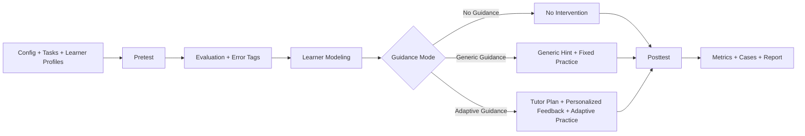

# Architecture Mermaid

Use this as a PPT drawing reference, not necessarily as raw slide text.

## Slide Caption

The prototype turns learner responses into learner state, uses the state to control the tutoring intervention, and evaluates outcomes on fixed posttest tasks.
