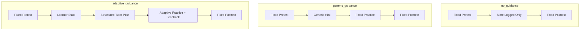

# Mode Comparison Mermaid

## PPT Notes

- The pretest and posttest bundles are the same across modes.
- Practice is an intervention and is not included in final `score_delta`.
- Adaptive mode is the only branch where learner state drives the tutoring plan.
